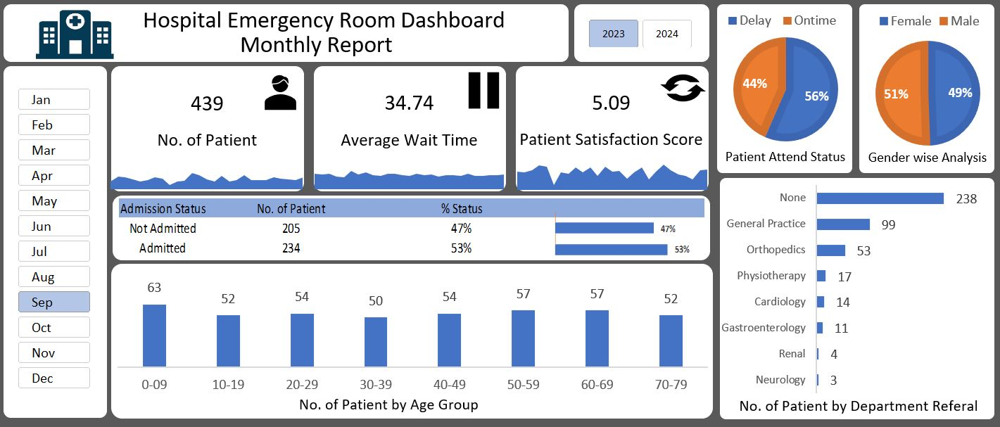

# Hospital Emergency Room Dashboard
## Project Overview
The Hospital Emergency Room Dashboard is an Excel-based data analytics project designed to monitor and analyze emergency room performance.
The dashboard provides an interactive monthly view of patient activity, waiting time, satisfaction, admission status, gender distribution, age groups, and department referrals.
It helps identify patient trends, operational patterns, and areas that may require attention.
## Dashboard Preview

## Project Objectives
- Analyze emergency room patient volume.
- Monitor average patient wait time.
- Track patient satisfaction.
- Compare admitted and non-admitted patients.
- Analyze patient distribution by gender.
- Analyze patients by age group.
- Identify department referral patterns.
- Monitor patient attendance status.
- Track daily trends and identify busy periods.
## Key Dashboard Metrics
### Total Patients
Shows the number of emergency room patients for the selected period.
### Average Wait Time
Displays the average time patients waited before receiving attention.
### Patient Satisfaction Score
Tracks the overall patient satisfaction level.
### Admission Status
Compares patients who were admitted with those who were not admitted.
### Patient Attend Status
Shows the proportion of patients who experienced delays versus those attended on time.
### Gender Analysis
Provides a comparison between female and male patients.
### Age Group Analysis
Analyzes patient volume across different age groups.
### Department Referral
Shows the number of patients referred to different departments such as:
- General Practice
- Orthopedics
- Physiotherapy
- Cardiology
- Gastroenterology
- Renal
- Neurology
## Trend Analysis
### 1. Patient Volume Trend
A daily trend using an area-style sparkline helps identify patterns such as:
- Busy days
- Lower patient-volume days
- Repeated daily patterns
- Potential seasonal trends
### 2. Average Wait Time Trend
An area chart can be used to track daily changes in waiting time.
Longer waiting-time periods can help identify days that may require operational improvement or additional resources.
### 3. Patient Satisfaction Trend
An area chart can be used to monitor changes in satisfaction over time.
Drops in satisfaction can be compared with:
- Higher patient volume
- Longer waiting times
- Admission pressure
- Other operational challenges
This helps identify possible relationships between emergency-room workload and patient experience.
## Tools Used
- Microsoft Excel
- Excel Charts
- Excel Sparklines
- Data Analysis
- Dashboard Design
- Data Visualization
## Key Features
- Interactive month selection
- Year selection
- KPI cards
- Area-style trend visualization
- Patient admission analysis
- Gender analysis
- Age-group analysis
- Department referral analysis
- Patient attendance analysis
- Data visualization for decision suppor
## Business Insights
The dashboard can help hospital management:
- Monitor emergency-room workload.
- Identify periods with higher patient demand.
- Monitor waiting-time patterns.
- Track patient satisfaction.
- Understand admission patterns.
- Identify commonly referred departments.
- Compare patient demographics.
- Identify areas that may require operational attention.
## Project Structure
Hospital-Emergency-Room-Dashboard/
│
├── README.md
│
├── Hospital_Emergency_Room_Dashboard.xlsx
│
└── Dashboard_Preview/
    └── Hospital_Emergency_Room_Dashboard.png
## Author
Danish Durrani
Aspiring Data Analyst
Skills: Excel | SQL | Power BI | Python | Data Analysis
## Disclaimer
This project is created for data analytics and portfolio purposes.
The dashboard data is used for demonstration and analytical practice.
